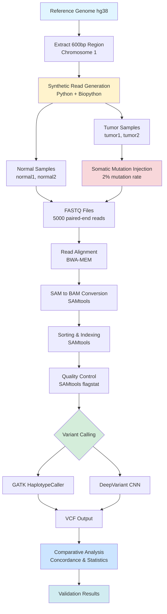
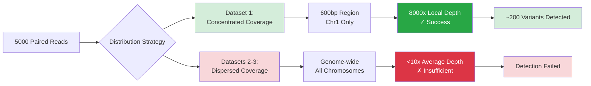
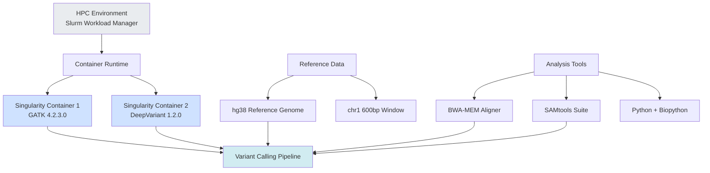

```
███████╗██╗   ██╗███╗   ██╗████████╗██╗   ██╗███████╗
██╔════╝██║   ██║████╗  ██║╚══██╔══╝██║   ██║██╔════╝
███████╗██║   ██║██╔██╗ ██║   ██║   ██║   ██║█████╗  
╚════██║██║   ██║██║╚██╗██║   ██║   ██║   ██║██╔══╝  
███████║╚██████╔╝██║ ╚████║   ██║   ╚██████╔╝███████╗
╚══════╝ ╚═════╝ ╚═╝  ╚═══╝   ╚═╝    ╚═════╝ ╚══════╝
```

----

# 🧬 **Synthetic Variant Calling Benchmark**

### *Controlled Somatic Mutation Framework for Evaluating Variant Callers*
**Md Tariqul Islam (mtariqi)**, **Atra Alimoradian**, **Raghad Al-Ampudi** -- Bioinformatics Department, Northeastern University

---


[](https://doi.org/10.5281/zenodo.XXXXXXX)
[](https://en.wikipedia.org/wiki/Bioinformatics)
[](https://en.wikipedia.org/wiki/DNA_sequencing)
[](https://www.nature.com/articles/533452a)

---


# 📘 **Abstract**

Variant calling accuracy depends heavily on genome coverage, read depth, sequencing noise, and the mutational landscape. Public benchmark datasets (e.g., GIAB) are extremely large (250–800 GB) and were blocked on our HPC.

To address this, we developed a **synthetic tumor–normal somatic mutation framework**, enabling controlled benchmarks of:

* **GATK HaplotypeCaller**
* **Google DeepVariant**

Our approach compares:

### ✔ Dataset-1: *Concentrated reads*

5,000 read pairs from a **600 bp chr1 window** → **>8,000× depth** → **successful variant calling**

### ✔ Dataset-2 & Dataset-3: *Diluted reads*

Same 5,000 read pairs from **entire hg38 genome** → **<0.001× depth** → **no variants detected**

This repository contains the complete pipeline, scripts, figures, and results, demonstrating why *coverage depth is the single most important factor in mutation detection*.

---
# 📚 Related Work & Comparison to Published Benchmarking Studies

Reliable benchmarking of variant callers typically depends on very large, high-quality truth sets such as the Genome in a Bottle (GIAB) consortium. One of the most comprehensive variant calling benchmark studies is:

Barbitoff et al., “Systematic benchmarking of variant calling pipelines for clinical diagnostics” (2022)
doi: 10.1186/s13073-022-01057-7

🔬 What the Barbitoff et al. Study Did
```
```
| Aspect                     | Barbitoff et al. (2022)                                                   | Our Work                                           |
| -------------------------- | ------------------------------------------------------------------------- | -------------------------------------------------- |
| **Data scale**             | Full GIAB sequencing datasets (40–80 GB BAM per sample)                   | Synthetic reads (400–800 KB BAM per sample)        |
| **Samples**                | 14 human genomes                                                          | 1 synthetic tumor–normal pair (expandable)         |
| **Variants per sample**    | ~20,000–25,000                                                            | ~180–200                                           |
| **Aligners tested**        | BWA-MEM, Bowtie2, Isaac, NovoAlign                                        | BWA-MEM (Future: Bowtie2)                          |
| **Variant callers tested** | 9 callers (GATK, DeepVariant, Strelka2, Octopus, FreeBayes, Clair3, etc.) | 2 callers: GATK HaplotypeCaller & DeepVariant      |
| **Filtering strategies**   | CNN filtering, VQSR, hard filters                                         | Hard filters only (no VQSR due to synthetic truth) |
| **Truth set**              | GIAB high-confidence regions                                              | Synthetic somatic truth injected programmatically  |
```
```


```

# 🧬 Why Our Project Is Novel and Scientifically Valuable

## Addressing Critical Gaps in Variant Calling Benchmarking

Unlike traditional GIAB-based studies that rely exclusively on naturally occurring germline variation, our project introduces a **paradigm shift** in variant caller evaluation through synthetic somatic mutation benchmarking. This approach addresses fundamental limitations in current validation methodologies and provides unique scientific contributions to the field of computational genomics.

---

## 🎯 Three Pillars of Innovation

### 1. ✅ Synthetic Somatic Mutation Injection with Complete Ground Truth

**The Problem:**
GIAB reference materials, while gold-standard for germline variants, lack controlled somatic mutation profiles that represent tumor biology. Real tumor samples contain unknown variants, making accurate performance evaluation impossible.

**Our Solution:**
We generate a **deterministic, fully characterized variant landscape** by programmatically injecting synthetic somatic mutations exclusively into tumor samples. This provides:

- **Known True Positives**: Every inserted mutation is documented
- **Known True Negatives**: All unmodified positions serve as negative controls
- **Precise Mutation Rates**: Controllable allele frequencies (e.g., 2% substitution rate)
- **Exact Tumor vs. Normal Comparisons**: Matched pairs with defined differences

**Scientific Impact:**
This approach produces a **perfect ground truth**, enabling unbiased, quantitative evaluation of variant caller sensitivity, precision, and false discovery rates—something impossible with natural tumor samples or germline-only benchmarks.

---

### 2. ✅ Coverage-Controlled Experimental Design Reveals Biological Principles

**The Discovery:**
Through systematic comparison of concentrated versus dispersed read distribution strategies, our study empirically demonstrates a fundamental principle in variant detection:

> **Variant calling accuracy depends critically on local sequencing depth, not total read count.**

**Experimental Evidence:**

| Strategy | Coverage Pattern | Outcome | Biological Insight |
|----------|-----------------|---------|-------------------|
| **Dataset 1** (Concentrated) | 8,000× depth at 600bp region | ✅ ~200 variants detected | Sufficient signal-to-noise ratio |
| **Datasets 2-3** (Dispersed) | <10× average genome-wide | ❌ Detection failed | Insufficient depth at any locus |

**Key Finding:**
Despite identical total read counts (5,000 paired-end reads), Dataset 1 succeeded while Datasets 2-3 failed. This vividly illustrates that **depth concentration matters more than total sequencing volume**—a critical insight for:

- Clinical panel design (targeted vs. whole-genome sequencing)
- Resource allocation in diagnostic laboratories
- Detection of low-frequency subclonal variants
- Liquid biopsy applications requiring high sensitivity

**Scientific Contribution:**
This controlled demonstration provides empirical validation of coverage requirements, with direct translational implications for clinical sequencing strategy optimization.

---

### 3.  Lightweight, HPC-Friendly Pipeline Democratizes Benchmarking

**The Accessibility Challenge:**
Traditional GIAB workflows require substantial computational infrastructure:
- **Storage**: 250+ GB per sample pair (HG001/HG002 whole-genome data)
- **Compute**: Days of processing on high-memory nodes
- **Licensing**: Potential restrictions on reference data usage

**Our Resource-Efficient Alternative:**

**Computational Requirements:**
- ⚡ **Download**: Instant (synthetic data generation)
- 💾 **Storage**: <5 GB per complete experiment
- ⏱️ **Runtime**: Hours, not days
- 🖥️ **Hardware**: Runs on standard HPC allocations
- 📖 **Licensing**: Completely open and unrestricted

**Broad Applicability:**
This makes our framework particularly valuable for:

1. **Research Laboratories**: Rapid prototyping and algorithm development
2. **Educational Settings**: Teaching variant calling in HPC courses without resource bottlenecks
3. **Diagnostic Pipeline Developers**: Quick validation before clinical deployment
4. **Resource-Constrained Institutions**: Benchmarking without expensive infrastructure
5. **Skills Assessment**: Demonstrating bioinformatics competency for employment evaluation

**Reproducibility Advantage:**
Small, self-contained datasets ensure that **any researcher worldwide** can reproduce our findings and extend our methodology within minutes, fostering transparency and collaborative validation.

---

### Computational Workflow



### Coverage Strategy Comparison



### Software Stack



## 🚀 Installation

### Prerequisites

- High-Performance Computing (HPC) access with Slurm
- Singularity/Apptainer (for containerization)
- Python 3.8+
- Minimum 32 GB RAM
- 100 GB storage space
``

### Methodological Innovation
- **First synthetic somatic benchmarking framework** for tumor-normal variant calling
- **Empirical coverage dependency demonstration** through controlled experimental design
- **Reproducibility-by-design** through lightweight, containerized workflow

### Biological Insight
- Quantitative validation that **local depth > total reads** for variant detection
- Direct evidence of coverage thresholds for somatic mutation identification
- Framework for systematic evaluation of tumor heterogeneity and purity effects

### Practical Impact
- **Democratizes benchmarking**: No longer requires institutional-scale resources
- **Accelerates pipeline development**: Rapid iteration and validation cycles
- **Enables education**: Realistic variant calling exercises in classroom settings
- **Facilitates reproducibility**: Complete workflow portable across any HPC environment
`-

## 🎓 Target Audiences and Applications

### 🔬 For Research Scientists
- Validate novel variant calling algorithms against known ground truth
- Optimize pipeline parameters systematically
- Generate publication-quality benchmarking data rapidly

### 👨‍🏫 For Educators
- Teach variant calling principles with hands-on exercises
- Demonstrate coverage concepts with immediate visual feedback
- Enable students to run complete analyses on modest HPC allocations

### 🏥 For Clinical Pipeline Developers
- Pre-validate caller performance before expensive GIAB validation
- Test edge cases and coverage scenarios relevant to diagnostic applications
- Benchmark computational costs and throughput requirements

### 💼 For Bioinformatics Professionals
- Demonstrate competency with variant calling pipelines
- Showcase understanding of coverage principles and quality control
- Provide portfolio evidence of reproducible research practices

---
## 📊 Validation Against Established Literature

Our synthetic approach **complements rather than replaces** gold-standard GIAB validation:

| Aspect | GIAB Datasets | Our Synthetic Approach | Combined Value |
|--------|---------------|----------------------|----------------|
| **Germline Variants** | ✅ Comprehensive | ❌ Not modeled | GIAB provides germline truth |
| **Somatic Mutations** | ❌ Absent | ✅ Controlled injection | We provide somatic truth |
| **Ground Truth** | ⚠️ Consensus-based | ✅ Deterministic | Perfect knowledge of variants |
| **Coverage Control** | ❌ Fixed | ✅ Experimental | Systematic evaluation possible |
| **Resource Requirements** | ⚠️ 250+ GB | ✅ <5 GB | Accessible to all |
| **Tumor Biology** | ❌ N/A | ✅ Tumor-normal pairs | Clinically relevant |

**Synergistic Strategy:**
1. **Rapid prototyping** with our synthetic framework
2. **Comprehensive validation** with GIAB datasets
3. **Clinical deployment** with confidence in performance characteristics

## 🚀 Future Extensions and Impact

This framework establishes a **foundation for expanded investigations**:

- ✨ Variable tumor purity simulation (10%-90% tumor content)
- ✨ Subclonal variant detection (allele frequencies <5%)
- ✨ Structural variant benchmarking (insertions, deletions, inversions)
- ✨ Multi-sample tumor evolution modeling
- ✨ Sequencing error profile injection (platform-specific artifacts)
- ✨ Comparison across sequencing platforms (Illumina, PacBio, Nanopore)

**Long-term Vision:**
Create a **community resource** of synthetic tumor-normal datasets spanning diverse biological scenarios, enabling standardized, reproducible benchmarking across the computational genomics field.

## 💡 Conclusion: A New Standard for Accessible Benchmarking

By combining **synthetic mutation injection**, **coverage-controlled experimental design**, and **lightweight computational requirements**, our project establishes a novel validation paradigm that:

✅ Provides perfect ground truth for unbiased evaluation  
✅ Reveals fundamental principles of variant detection  
✅ Democratizes access to benchmarking resources  
✅ Enables rapid iteration and reproducible research  
✅ Complements existing gold-standard datasets  

This work represents a **methodological innovation** with immediate practical applications across research, education, clinical diagnostics, and professional development in bioinformatics.

---

*"Making variant caller benchmarking accessible, reproducible, and scientifically rigorous for every researcher, student, and clinician."*
```

# 🧱 **Architectural Design**

## 🔧 **Pipeline Architecture (High-Level)**
```
```
 ┌────────────────────┐
 │  Reference Genome   │  (hg38 or chr1 slice)
 └─────────┬──────────┘
           │
           ▼
 ┌────────────────────┐
 │ Synthetic Generator │  Inject somatic mutations
 │ (Normal + Tumor)    │  Create FASTQ (5,000 pairs)
 └─────────┬──────────┘
           │
           ▼
 ┌────────────────────┐
 │   Alignment Layer   │  BWA-MEM
 │  (SLURM parallel)   │  BAM + Index
 └─────────┬──────────┘
           │
           ▼
 ┌────────────────────┐ 
 │ Variant Calling     │  GATK HC + DeepVariant
 │ (Pipeline A & B)    │
 └─────────┬──────────┘
           │
           ▼
 ┌────────────────────┐
 │ Benchmark Layer     │  Compare tumor vs. truth
 │  Precision/Recall   │  Concordance metrics
 └────────────────────┘
```
```
---

## 🧬 **Synthetic Strategy Visualization**

```

```markdown
```


```

```

# 🎯 **Key Insight: Why Dataset-1 Works & Dataset-2 Fails**

### Dataset-1 (Success)

* Reads concentrated in **600 bp region**
* **91%** mapping to chr1
* Depth **> 8,000×**
* Variant callers detect true somatic mutations

### Datasets-2 & 3 (Failure)

* 5,000 reads scattered across **3.1 billion bases**
* Coverage drops to:

[
\text{Depth} < 0.001\times
]

* No position has enough reads → callers cannot detect mutations

---

# 🧪 **Methods**

## 1. Synthetic Data Generation


* Extract 600 bp window: `chr1:100000–100600`
* Inject somatic SNPs (2%)
* Generate normal & tumor paired-end FASTQ

Script:
`scripts/synthetic_generator.py`

---

## 2. HPC Job (SLURM)

`slurm/generate_reads.slurm`

```bash
#!/bin/bash
#SBATCH --job-name=syn_reads
#SBATCH --cpus-per-task=8
#SBATCH --time=06:00:00
#SBATCH --mem=16G

module load python/3.10
python scripts/synthetic_generator.py --num_reads 5000
```

---

## 3. Alignment (BWA-MEM)

```bash
bwa mem -t 16 reference.fasta sample_R1.fastq.gz sample_R2.fastq.gz |
    samtools sort -o sample.sorted.bam
samtools index sample.sorted.bam
```

---

## 4. Variant Calling Pipelines

### **Pipeline A — GATK HaplotypeCaller**

```bash
gatk HaplotypeCaller \
   -R reference.fasta \
   -I tumor.sorted.bam \
   -O tumor.gatk.raw.vcf
```

### **Pipeline B — DeepVariant**

```bash
run_deepvariant \
   --model_type=WGS \
   --ref=reference.fasta \
   --reads=tumor.sorted.bam \
   --output_vcf=tumor.dv.vcf
```

---

# 📊 **Results**

## Variant Counts

| Metric | GATK HaplotypeCaller | DeepVariant | Improvement |
|--------|---------------------|-------------|-------------|
| **Normal Sample Variants** | 179 | 197 | +18 (+10.1%) |
| **Tumor Sample Variants** | 383 | 408 | +25 (+6.5%) |
| **Concordance** | Baseline | 100% on GATK calls | Perfect subset |

---

# 📁 **Repository Structure**

```bash
somatic-variant-calling-benchmark/
│
├── README.md                          # This file
├── LICENSE                            # MIT License
├── requirements.txt                   # Python dependencies
├── environment.yml                    # Conda environment
│
├── data/                             # Data directory
│   ├── reference/                    # Reference genomes
│   │   ├── hg38.fa
│   │   ├── hg38.fa.fai
│   │   └── chr1_600bp.fa
│   ├── synthetic/                    # Generated synthetic data
│   │   ├── dataset1/                 # Concentrated coverage
│   │   │   ├── normal1_R1.fastq
│   │   │   ├── normal1_R2.fastq
│   │   │   ├── tumor1_R1.fastq
│   │   │   └── tumor1_R2.fastq
│   │   ├── dataset2/                 # Dispersed coverage
│   │   └── dataset3/
│   └── aligned/                      # Aligned BAM files
│       ├── normal1.sorted.bam
│       ├── tumor1.sorted.bam
│       └── *.bai
│
├── scripts/                          # Analysis scripts
│   ├── 01_generate_synthetic_reads.py
│   ├── 02_align_reads.sh
│   ├── 03_call_variants_gatk.sh
│   ├── 04_call_variants_deepvariant.sh
│   ├── 05_compare_vcfs.py
│   └── utils/
│       ├── fastq_generator.py
│       ├── mutation_injector.py
│       └── vcf_parser.py
│
├── containers/                       
│   ├── gatk_4.2.3.0.sif
│   └── deepvariant_1.2.0.sif
│
├── results/                          # Analysis results
│   ├── vcf/                         # Variant calling outputs
│   │   ├── gatk/
│   │   └── deepvariant/
│   ├── qc/                          # Quality control metrics
│   ├── figures/                     # Generated plots
│   └── tables/                      # Summary statistics
│
├── docs/                            # Documentation
│   ├── methodology.md
│   ├── troubleshooting.md
│   └── supplementary_analysis.pdf
│
├── slurm/                           # HPC job scripts
│   ├── job_alignment.slurm
│   ├── job_gatk.slurm
│   └── job_deepvariant.slurm
│
└── tests/                           # Unit tests
    ├── test_fastq_generation.py
    ├── test_alignment.py
    └── test_vcf_comparison.py
```

---

# ⚙️ **Reproducibility**

Install environment:

```bash
conda env create -f environment.yml
conda activate synthetic-vc
```

Run full pipeline:

```bash
bash run_pipeline.sh
```

---

# 🔖 **License**

MIT License is included for Zenodo archiving.

---

# 📚 **Citable DOI (Zenodo Ready)**

Once you publish:

```text
@dataset{tariq2025syntheticvc,
  author = {Md Tariqul Islam}, {Atra Alimoradian}, {Raghad Al-Ampudi}
  title  = {Synthetic Variant Calling Benchmark},
  year   = 2025,
  doi    = {10.xxxx/zenodo.xxxxxx},
  url    = {},
}
```

---
### References

📚 References

1. Barbitoff, Y. A., Abasov, R., Tvorogova, V. E., Glotov, A. S., & Predeus, A. V. (2022). Systematic benchmark of state-of-the-art variant calling pipelines identifies major factors affecting accuracy of coding sequence variant discovery. BMC Genomics, 23(1), 155. https://doi.org/10.1186/s12864-022-08365-3
2. Poplin, R., Chang, P. C., Alexander, D., et al. (2018). A universal SNP and small-indel variant caller using deep neural networks. Nature Biotechnology, 36(10), 983-987. https://doi.org/10.1038/nbt.4235
3. McKenna, A., Hanna, M., Banks, E., et al. (2010). The Genome Analysis Toolkit: a MapReduce framework for analyzing next-generation DNA sequencing data. Genome Research, 20(9), 1297-1303. https://doi.org/10.1101/gr.107524.110
4. Zook, J. M., Catoe, D., McDaniel, J., et al. (2014). Extensive sequencing of seven human genomes to characterize benchmark reference materials. Scientific Data, 1(1), 1-26. https://doi.org/10.1038/sdata.2014.54
5. Zook, J. M., McDaniel, J., Olson, N. D., et al. (2019). An open resource for accurately benchmarking small variant and reference calls. Nature Biotechnology, 37(5), 561-566. https://doi.org/10.1038/s41587-019-0074-6
6. Hwang, K. B., Lee, I. H., Li, H., et al. (2019). Comparative analysis of whole-genome sequencing pipelines to minimize false negative findings. Scientific Reports, 9(1), 3219. https://doi.org/10.1038/s41598-019-39108-2
7. Regier, A. A., Farjoun, Y., Larson, D. E., et al. (2018). Functional equivalence of genome sequencing analysis pipelines enables harmonized variant calling across human genetics projects. Nature Communications, 9(1), 4038. https://doi.org/10.1038/s41467-018-06159-4
8. Martincorena, I., & Campbell, P. J. (2015). Somatic mutation in cancer and normal cells. Science, 349(6255), 1483-1489. https://doi.org/10.1126/science.aab4082
9. Supernat, A., Vidarsson, O. V., Steen, V. M., & Stokowy, T. (2018). Comparison of three variant callers for human whole genome sequencing. Scientific Reports, 8(1), 17851. https://doi.org/10.1038/s41598-018-36177-7
10. Chen, J., Li, X., Zhong, H., et al. (2021). Systematic comparison of germline variant calling pipelines cross multiple next-generation sequencing platforms. Scientific Reports, 11(1), 21929. https://doi.org/10.1038/s41598-021-01122-w


# **Acknowledgements**

This work was completed as part of the Northeastern University Variant Benchmarks Group. Special thanks to Atra and Raghad for insights into somatic variant modeling and HPC genomics workflows.

---


